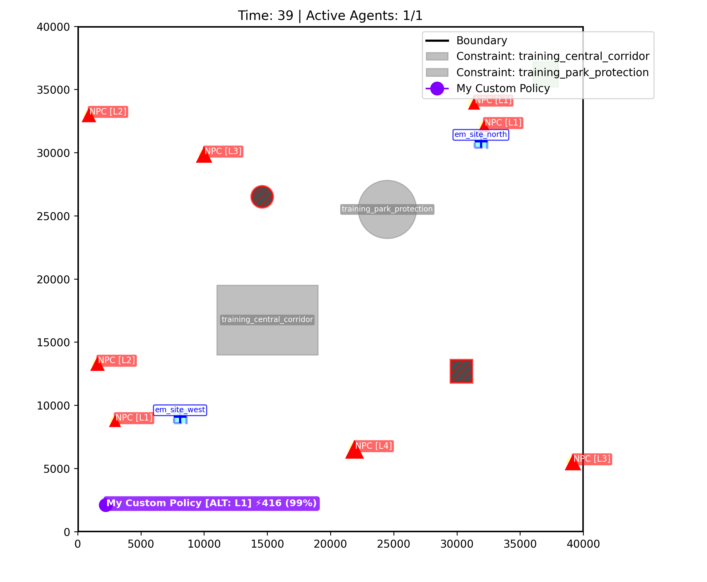
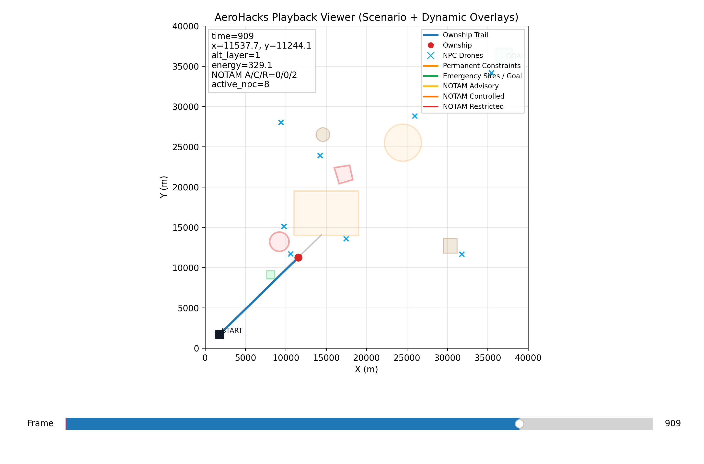

# AeroHacks RTM - README de Travail (Plan Strategique Complet)

Ce document est ton plan d execution pour le challenge RTM.
Il transforme les regles du package en une feuille de route claire: quoi faire, dans quel ordre, avec quels criteres de qualite.

---

## 1) Objectif du challenge (traduction operationnelle)

Tu dois concevoir un algorithme Python qui pilote un drone de maniere autonome dans un espace aerien simule, en equilibrant:

- succes de mission (atteindre la zone but a la bonne altitude),
- efficacite de navigation (temps + trajectoire),
- securite et evitement (trafic + obstacles),
- conformite reglementaire (NOTAM et contraintes actives),
- energie (eviter depletion et gerer les marges).

Le coeur du challenge n est pas juste "aller vite": c est aller au but en restant robuste, legal et sur.

---

## 2) Ce qui est evalue (slides + README)

Selon les slides "Global RTM Evaluator", ton systeme est juge sur:

- Mission success
- Efficiency of navigation
- Safety and avoidance behavior

Les meilleurs algorithmes vont en final round et doivent presenter la logique et l architecture de leur solution.

Implication pratique:

- Tu dois coder une policy efficace,
- mais aussi etre capable d expliquer clairement tes choix d architecture,
- et montrer des preuves via playback/scenarios que ta policy est robuste.

---

## 3) Contrat technique non negociable (a respecter absolument)

### 3.1 Signature policy

Dans my_algorithm/policy.py, la classe doit etre:

- class MyPolicy(Policy)
- def step(self, observation: Observation) -> Plan

### 3.2 Entree a chaque tick

Le simulateur passe un objet dataclass Observation (pas du JSON brut), contenant notamment:

- current_time
- ownship_state (position, altitude, energie)
- mission_goal
- active_constraints
- traffic_tracks

### 3.3 Sortie attendue

Tu dois retourner:

- Plan(steps=[...])

Avec exactement 5 ActionStep a chaque tick.

### 3.4 Actions autorisees

- WAYPOINT: mouvement vers target_position et/ou target_alt_layer
- HOLD: maintien (position/altitude)
- EMERGENCY_LAND: descente vers altitude 0

### 3.5 Erreurs fatales de format

Si la sortie n est pas valide (type incorrect, plan pas a 5 steps, champs invalides), la simulation peut terminer en echec catastrophique.

---

## 4) Regles de score et conditions catastrophiques

### 4.1 Structure du score

- Base succes: +1000
- Bonus temps: plus tu finis tot, plus tu prends de points
- Atterrissage urgence sur site dedie: credit partiel (par defaut 300)

### 4.2 Penalites (rappel utile)

- Controlled airspace: -50 par step
- Restricted airspace: -200 par step
- Advisory separation loss: -10
- Conflict separation loss: -150

### 4.3 Catastrophique (score final force a 0.0)

- Collision
- Batterie vide hors resolution urgence valide
- >= 5 steps consecutifs en restricted
- Sortie des limites carte ou collision obstacle statique

Message cle:

Une policy "rapide mais sale" peut finir a 0.0. La robustesse est prioritaire.

---

## 5) Ce que tu dois faire - checklist complete

## Phase A - Setup et verification minimale

1. Verifier que MyPolicy existe bien dans my_algorithm/policy.py.
2. Lancer un run de base:
   - .\AeroHacksSim.exe --policy ./my_algorithm --scenario example_training
3. Verifier que playback.json est genere/mis a jour.
4. Installer les deps visualisation:
   - python -m pip install -r requirements-viz.txt
5. Ouvrir le viewer avec overlays:
   - python view_playback.py --playback playback.json --scenario scenarios/public/example_training.json --hidden scenarios/hidden/example_training.json

Definition de "phase A validee":

- la simulation s execute,
- la policy est bien chargee,
- le playback s affiche,
- tu peux naviguer frame par frame.

## 5.1 Structure du code: a quoi sert chaque fichier

Voici la structure du package et le role pratique de chaque fichier:

- `AeroHacksSim.exe`
   - Binaire du simulateur.
   - C est lui qui charge ta policy, execute la mission, applique les regles et produit le score.
- `my_algorithm/__init__.py`
   - Fichier de package Python.
   - Permet au simulateur d importer correctement ton module policy.
- `my_algorithm/policy.py`
   - Fichier principal de ton algorithme.
   - Contient `MyPolicy.step(...)`, appelee a chaque tick.
   - C est le fichier numero 1 a modifier.
- `models_reference.py`
   - Reference des types (Observation, Plan, ActionStep, etc.).
   - Sert a comprendre les champs disponibles et les contraintes de format.
   - A lire, mais a ne pas modifier.
- `view_playback.py`
   - Viewer matplotlib pour analyser `playback.json` frame par frame.
   - Tres utile pour debug visuel (zones, trafic, energie, A/C/R).
   - Normalement pas obligatoire a modifier pour la competition.
- `requirements-viz.txt`
   - Dependances Python du viewer.
   - Installe via `python -m pip install -r requirements-viz.txt`.
- `scenarios/public/example_training.json`
   - Partie publique du scenario: carte, depart, objectif, contraintes statiques, scoring config.
   - Utilise pour comprendre la geometrie de test.
- `scenarios/hidden/example_training.json`
   - Partie cachee dynamique: NOTAM temporels et traces trafic.
   - Utilise pour tester robustesse sur dynamique reelle.
- `README.md`
   - Guide officiel fourni par les organisateurs.
   - Source de verite sur contrat API, scoring et commandes.
- `README_NOTES.md`
   - Ton guide de travail (ce document), orientee execution et iteration.

### Fichiers que tu dois modifier en priorite

- `my_algorithm/policy.py` (obligatoire)
   - Toute la logique de navigation, evitement et strategie est ici.
- `scenarios/public/*.json` et `scenarios/hidden/*.json` (fortement recommande)
   - Cree tes propres cas de test pour valider robustesse avant soumission.


### Fichiers a ne pas toucher (en pratique)

- `AeroHacksSim.exe`
- `models_reference.py`
- `README.md` officiel (garde-le comme reference)

Regle simple:

- 90% de la valeur competitive vient de `my_algorithm/policy.py` + qualite de tes scenarios de test.

## Phase B - Comprendre ton baseline actuel

Le baseline actuel dans my_algorithm/policy.py:

- va en ligne droite vers le centre de la zone but,
- remplit 5 waypoints,
- force l altitude cible du goal,
- n anticipe pas contraintes et trafic.

Ce que ca implique:

- risque de traverser des zones penalisantes,
- risque de conflits/collisions trafic,
- gestion energie trop naive.

## Phase C - Ajouter la securite minimale (priorite absolue)

1. Filtrage contraintes actives:
   - detecter si trajectoire prevue coupe une zone controlled/restricted active a l altitude courante.
2. Evitement trafic simple:
   - verifier distance aux NPC proches (court horizon).
3. Regle de repli:
   - si risque eleve immediat, remplacer certains steps par HOLD ou waypoint d evitement local.

Criteres de sortie de phase C:

- baisse visible des penalites lourdes,
- plus de controle sur les episodes "pres du trafic",
- moins d entrees en restricted.

## Phase D - Planification plus intelligente

1. Ajouter un cout de trajectoire multi-objectif:
   - distance,
   - risque contraintes,
   - risque trafic,
   - cout energie.
2. Replanification frequente:
   - recalculer a chaque observation (horizon glissant).
3. Utiliser l altitude comme degre de liberte:
   - changer de couche pour contourner conflits/NOTAM quand rentable.

## Phase E - Robustesse challenge

1. Creer des scenarios custom public/hidden avec le meme nom de base.
2. Tester des cas limites:
   - trafic dense,
   - NOTAM qui escaladent tard,
   - marges energie faibles,
   - approche finale compliquee vers goal.
3. Mesurer la variance run-to-run sur plusieurs scenarios.

## Phase F - Preparation finale (presentation)

1. Documenter l architecture de decision:
   - perception,
   - evaluation risque,
   - generation plan,
   - fallback securite.
2. Preparer 2 ou 3 playback representatifs:
   - succes propre,
   - cas difficile gere correctement,
   - exemple de recovery.
3. Expliquer les tradeoffs:
   - pourquoi certains detours augmentent le score final.

---

## 6) Partie creative: ou tu peux vraiment te differencier

La creativite ici n est pas du design visuel, c est du design algorithmique et systeme.

### 6.1 Prediction trafic

- Exploiter traffic_tracks.intent quand disponible.
- Evaluer les positions futures a court/moyen horizon.
- Penaliser fortement les trajectoires qui convergent vers un conflit.

### 6.2 Anticipation NOTAM temporelle

- Ne pas reagir trop tard a l escalation advisory -> controlled -> restricted.
- Detecter les corridors qui vont devenir dangereux dans N ticks.
- Preferer un detour precoce plutot qu une fuite tardive.

### 6.3 Navigation multi-couches altitude

- Utiliser les alt layers comme 3e dimension tactique.
- Contourner horizontalement ET verticalement.
- Arbitrer cout changement altitude vs cout penalites evitees.

### 6.4 Strategie energie-risque

- Calculer une marge energie previsionnelle.
- Si mission devient trop risquee, declencher un plan de secours vers emergency site.
- Eviter le piege "presque au but mais batterie critique".

### 6.5 Scenarios adversariaux maison

- Inventer des cas que les autres n ont pas testes.
- Forcer des dilemmes reels: vitesse vs securite vs legalite.
- Utiliser ces cas pour muscler ta policy avant evaluation.

---


### NOTAM A/C/R: signification exacte

Dans le viewer, la ligne `NOTAM A/C/R` indique combien de zones dynamiques sont actives dans chaque phase:

- A = Advisory
- C = Controlled
- R = Restricted

Detail de chaque lettre:

- Advisory (A): phase d avertissement. Le risque est present et doit etre anticipe. Dans l ecosysteme du challenge, c est la premiere alerte d une zone qui peut se durcir ensuite.
- Controlled (C): phase avec penalite operationnelle. Rester dans une zone controlled coute des points a chaque step (penalite plus faible que restricted, mais repetitive).
- Restricted (R): phase la plus critique. Penalite forte par step et risque d echec catastrophique si tu restes trop longtemps en restricted de maniere consecutive.

Lecture pratique:

- `NOTAM A/C/R = 0/0/0` signifie aucune zone dynamique active.
- `NOTAM A/C/R = 0/0/2` signifie deux zones sont deja au niveau Restricted, donc priorite immediate a l evitement.


### Methode d analyse frame par frame recommande

1. Se placer juste avant une perte de score brutale.
2. Lire A/C/R et la position du drone.
3. Verifier proximite NPC et altitudes relatives.
4. Verifier si la trajectoire projetee coupe une zone controlled/restricted.
5. Noter la decision policy du tick et ce qu elle aurait du faire.
6. Corriger une regle a la fois, puis rerun.

---

## 8) Roadmap d amelioration de ta policy (ordre conseille)

## Niveau 1 - Gains rapides (fort impact)

1. Evitement contraintes actif:
   - si waypoint coupe restricted, recalcul local.
2. Evitement trafic local:
   - s ecarter lateralement en cas de proximite critique.
3. Verif energie simple:
   - empecher les plans qui menent a depletion.

## Niveau 2 - Robustesse intermediaire

1. Cout composite (distance + risque).
2. Gestion altitude opportuniste.
3. Replanification receding horizon.

## Niveau 3 - Niveau finaliste

1. Prediction multi-agent plus longue.
2. Detection de "pieges" NOTAM (zones qui se ferment dans le temps).
3. Politique de fallback explicite et prouvable.

---

## 9) Instrumentation conseillee (pour progresser plus vite)

Ajouter des logs legers (sans surcharger) a chaque tick:

- current_time
- score local estime / penalites detectees
- action retenue (type + cible)
- risque contraintes estime
- risque trafic estime
- energie restante et marge au goal

Puis maintenir un petit tableau de suivi par scenario:

- score final
- statut (success / emergency / catastrophic)
- nombre d evenements advisory/conflict
- steps en controlled/restricted
- temps de completion

C est la maniere la plus rapide d iterer sans te perdre.

---

## 10) Criteres go/no-go avant soumission

Go si:

- Plan valide (5 steps) garanti sur tous les ticks,
- score > 0 stable sur tous les scenarios de test internes,
- aucun cas frequent de restricted consecutif,
- baisse claire des conflits trafic,
- comportement explicable en presentation.

No-go si:

- instabilite selon scenario,
- reussite "fragile" (un petit changement casse tout),
- dependance excessive a un seul scenario facile,
- absence de strategie de secours energie.

---

## 11) Erreurs frequentes a eviter

- Traiter observation comme JSON au lieu d objet.
- Retourner moins ou plus de 5 ActionStep.
- Garder une logique purement geometrique sans dimension reglementaire.
- Ignorer l altitude comme variable de decision.
- Corriger trop de choses a la fois sans protocole de test.

---

## 12) Plan de travail concret sur 5 sessions

### Session 1

- verifier pipeline complet,
- reproduire baseline,
- lire 2-3 playbacks en detail,
- lister causes principales de perte de points.

### Session 2

- implementer evitement contraintes minimal,
- valider sur scenario training,
- comparer score avant/apres.

### Session 3

- ajouter evitement trafic local + ajustements altitude,
- stress tests trafic dense.

### Session 4

- ajouter gestion energie + fallback emergency,
- tester scenarios limites.

### Session 5

- nettoyage logique,
- preparation artefacts de presentation,
- selection des meilleurs runs.

---

## 13) Resume executif

Ton objectif n est pas de faire une trajectoire "la plus courte".
Ton objectif est de faire une trajectoire "la meilleure sous contraintes".

Priorite reelle:

1. Survivre (eviter catastrophique)
2. Respecter les regles (eviter grosses penalites)
3. Optimiser ensuite (temps/efficacite)

Si tu suis cette sequence, tu augmentes fortement tes chances de score eleve et de qualification finale.


## Explication interface


Cette image correspond a l interface de playback lors d un run baseline (policy non amelioree) en exécutant la commande:
```
.\AeroHacksSim.exe --policy ./my_algorithm --scenario example_training
```

Voici comment lire chaque element:

### 1. Titre de la fenetre

- `AeroHacks Playback Viewer (Scenario + Dynamic Overlays)`
- Indique que le rendu combine la trajectoire du drone avec les couches statiques (scenario public) et dynamiques (hidden/NOTAM + trafic).

### 2. Axes X/Y

- Axe X (m) et axe Y (m): coordonnees en metres sur la carte 2D.
- La position de l ownship et des NPC est toujours interpretee dans ce repere.

### 3. Drone principal (ownship)

- Point rouge: position instantanee du drone au frame courant.
- Ligne bleue: historique de trajectoire du drone jusqu au frame courant.

Ce duo permet de verifier si la policy fait un chemin propre ou des zigzags risqués.

### 4. Position de depart et zone objectif

- `START`: point de depart.
- `GOAL`: zone de mission a atteindre (avec contrainte d altitude cible).

Tu peux lire d un coup d oeil si le drone avance vers la mission ou s en ecarte.

### 5. Contraintes statiques

- `Permanent Constraints` (orange): zones permanentes a eviter autant que possible.
- `Emergency Sites / Goal` (vert): zones utiles (site urgence + objectif).
- Objets de decor statiques (obstacles): zones qui peuvent produire des collisions si intersectees.

### 6. Contraintes dynamiques NOTAM

- `NOTAM Advisory` (jaune)
- `NOTAM Controlled` (orange soutenu)
- `NOTAM Restricted` (rouge)

Ces zones evoluent dans le temps. Plus une zone monte en phase, plus le risque score/catastrophique augmente.

### 7. Trafic NPC

- `NPC Drones` (croix bleues): positions instantanees des autres drones.
- Traces NPC (quand visibles): petit historique recent de leur mouvement.

Ce bloc est crucial pour identifier rapidement les situations de separation dangereuse.

### 8. Panneau d etat (boite en haut a gauche)

Tu y lis:

- `time`: tick courant
- `x, y`: position courante de l ownship
- `alt_layer`: couche d altitude courante
- `energy`: energie restante
- `NOTAM A/C/R`: nombre de zones dynamiques actives par phase
- `active_npc`: nombre de drones NPC actifs

Ce panneau est le meilleur resume numerique pour diagnostiquer une decision policy frame par frame.

### 9. Legende (en haut a droite)

Elle fait la correspondance exacte couleur/symbole -> objet simule. Utilise-la comme reference quand tu compares deux runs.

### 10. Ce que l image dit sur un premier run baseline

- La policy baseline suit surtout une logique de rapprochement geometrique vers le but.
- Sans logique risque/NOTAM/trafic, la trajectoire peut sembler correcte visuellement au debut mais devenir couteuse plus tard.
- L interface te montre precisement quand la situation se degrade: augmentation des zones C/R, proximites NPC, decisions de cap non defensives.

En pratique, utilise cette section image comme checklist de debug visuel avant chaque iteration de policy.

## Explication interface view_playback.py 


Cette capture montre le viewer interactif genere par view_playback.py pendant la lecture d un playback.

Objectif de cette interface:

- comprendre ce que fait la policy dans le temps,
- relier une perte de score a une cause visuelle,
- identifier rapidement les risques constraints, trafic, energie.

### 1) Barre Frame en bas (slider)

La barre en bas est le controle temporel principal.

- Frame: index de la capture temporelle affichee.
- Curseur: permet de se deplacer manuellement dans la simulation.
- Nombre a droite (ici 909): frame courante.

Comment l utiliser:

- glisser pour sauter a un moment precis,
- avancer/reculer frame par frame pour analyser une decision,
- comparer juste avant et juste apres une penalite.

Lecture utile:

- frame faible = debut du run,
- frame elevee = fin de run,
- si la trajectoire se degrade apres une certaine frame, c est souvent lie a une evolution NOTAM ou a une convergence trafic.

### 2) Panneau de variables en haut a gauche

Le bloc texte resume l etat du drone au frame affiche:

- time: tick simulation courant.
- x, y: position actuelle du drone.
- alt_layer: altitude discrete actuelle.
- energy: energie restante.
- NOTAM A/C/R: nombre de zones actives en Advisory, Controlled, Restricted.
- active_npc: nombre de drones trafic actifs.

Interpretation rapide de la capture fournie:

- time=909: on est au milieu/avance du run.
- x=11537.7, y=11244.1: le drone est dans le quart gauche-centre de la carte.
- alt_layer=1: altitude basse a moyenne.
- energy=329.1: batterie encore confortable mais en baisse continue.
- NOTAM A/C/R=0/0/2: deux zones en phase Restricted sont actives, priorite a l evitement.
- active_npc=8: trafic dense en continu.

### 3) Legende et correspondance exacte des formes

Chaque objet visible sur la carte correspond a un item de la legende en haut a droite.

- Ownship Trail
   - Forme visible: ligne bleue epaisse.
   - Signification: historique du trajet deja parcouru par ton drone.
- Ownship
   - Forme visible: point rouge plein.
   - Signification: position actuelle du drone au frame courant.
- NPC Drones
   - Forme visible: croix bleues.
   - Signification: positions des drones trafic au frame courant.
- Permanent Constraints
   - Formes visibles: zones orange clair (rectangle, cercle, polygones selon scenario).
   - Signification: zones permanentes du scenario public.
- Emergency Sites / Goal
   - Formes visibles: vert (petit carre/zone de secours et zone objectif).
   - Signification: destination mission et zones d atterrissage urgence.
- NOTAM Advisory
   - Forme visible: contour jaune.
   - Signification: phase d avertissement.
- NOTAM Controlled
   - Forme visible: contour orange soutenu.
   - Signification: phase penalisante intermediaire.
- NOTAM Restricted
   - Forme visible: contour rouge.
   - Signification: phase la plus critique avec penalite forte.

### 4) Description des formes visibles dans ta capture

Sur cette image precise, on observe:

- un segment de trajectoire bleue partant de START vers la position courante (point rouge),
- plusieurs croix bleues autour de la zone de vol (trafic actif),
- une grande zone orange rectangulaire centrale (permanent constraint),
- au moins un cercle orange en haut (autre contrainte permanente),
- une zone rouge contournee a gauche-centre (NOTAM Restricted),
- une zone rouge inclinee vers le haut-centre (autre region dynamique restrictive),
- des zones vertes associees a objectif et secours (dont GOAL en haut a droite).

Conclusion visuelle immediate:

- le drone progresse vers la mission,
- mais il evolue dans un contexte de trafic dense et de NOTAM restrictees actives,
- toute logique ligne droite pure devient risquee a ce stade.

### 5) Comment lire la carte pour debugger ta policy

Procedure pratique:

1. Place le curseur juste avant une chute de score.
2. Lis les variables du panneau (A/C/R, energy, alt_layer, active_npc).
3. Regarde si le point rouge ou son prolongement probable traverse une zone orange/rouge.
4. Regarde les croix bleues proches et la distance laterale.
5. Verifie si un changement d altitude aurait evite la zone ou le trafic.
6. Corrige une seule regle dans la policy, puis rerun.

### 6) Signaux d alerte a surveiller dans le viewer

- A/C/R qui passe de 0/0/0 a 0/0/1 puis 0/0/2.
- Point rouge proche d un contour rouge (restricted).
- Croisillons NPC regroupes autour de la route directe.
- Energie qui baisse alors que la route devient plus longue ou plus dangereuse.

Si tu relies ces signaux a tes decisions de policy, tu peux iterer beaucoup plus vite et eviter les echecs catastrophiques.